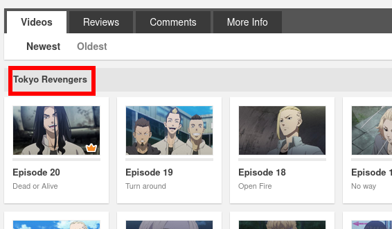

# Crunchyroll Subtitles Downloader

This tool helps you download all of a season's subtitles list, in your choosen language.

## Installation

Install it from Pypi or clone the repo and install the requirements.

```bash
pip install crunchyrollsubdownloader
```

### FlareSolverr

[FlareSolverr](https://github.com/FlareSolverr/FlareSolverr) is a tool to bypass Cloudflare protection. Crunchyroll uses it and this tool requires FlareSolverr to work.

You can set it up with a simple Docker command for instance:

```bash
docker run --rm -p 8191:8191 -e LOG_LEVEL=info ghcr.io/flaresolverr/flaresolverr:latest
```

This will run the Docker container and clean it when you CTRL-C. FlareSolverr is exposed on the `8191` port.

By default, this tool will try to reach it at `http://localhost:8191`. But if you need to specify a custom URL, use the `--flaresolverr` argument right before the commands calls (`dl`, `lang`...)

## Usage

```
usage: crunchyrollsubdownloader [-h] [--flaresolverr FLARESOLVERR] [-v] {dl,lang,seasons} ...

positional arguments:
  {dl,lang,seasons}     Subcommands
    dl                  Directly download subtitles with a given season name and language
    lang                Shows list of available subtitles for a given show and season name
    seasons             Shows list of seasons for a given show

optional arguments:
  -h, --help            show this help message and exit
  --flaresolverr FLARESOLVERR
                        Flaresolverr API URL. Default: http://localhost:8191
  -v                    Verbose mode
```

### Download a season subtitles

```
usage: crunchyrollsubdownloader dl [-h] show_url season_name lang

positional arguments:
  show_url     Crunchyroll show URL
  season_name  Crunchyroll season name on the webpage
  lang         Crunchyroll language

optional arguments:
  -h, --help   show this help message and exit
```

- `show_url` is the simple show URL, where the full list of episodes is displayed
- `season_name` is the name in the season dropdown
  
- `lang` is a language code found with the language command explained below (such as `enUS`, `frFR`...)

```bash
crunchyrollsubdownloader dl https://www.crunchyroll.com/tokyo-revengers "Tokyo Revengers" enUS
```

### Display list of languages for a given season

```
usage: crunchyrollsubdownloader lang [-h] show_url season_name

positional arguments:
  show_url     Crunchyroll show URL
  season_name  Crunchyroll season name on the webpage

optional arguments:
  -h, --help   show this help message and exit
```

Arguments are the same as above.

```bash
crunchyrollsubdownloader lang https://www.crunchyroll.com/tokyo-revengers "Tokyo Revengers"
```

### Display list of seasons for a given show

```
usage: crunchyrollsubdownloader seasons [-h] show_url

positional arguments:
  show_url    Crunchyroll show URL

optional arguments:
  -h, --help  show this help message and exit
```

```bash
crunchyrollsubdownloader seasons https://www.crunchyroll.com/tokyo-revengers
```
